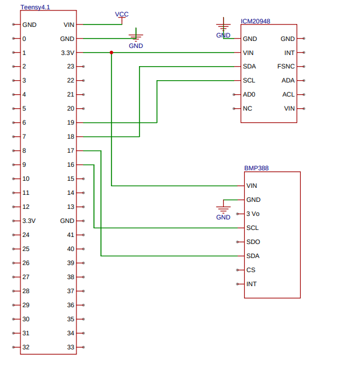

# USLI 2026 Payload Sensors Code

This repository contains code for the sensors selected for the payload being developed by the team for the **NASA Student Launch Initiave (USLI) 2026**.

## Overview

The project aims to integrate various sensors into a payload for the USLI 2026 competition. This repository includes the code required to interface, collect data, and perform any necessary signal processing for each sensor. The sensors selected for the payload will provide key measurements that will help to achieve the desired goal.

## Sensors Involved

- Sensor 1: ICM 20948
  - Description: It is a 9-axis MotionTracking device that includes an accelerometer, a gyroscope, and an magnetometer. 

- Sensor 2: BMP388  
  - Description: high-precision digital barometric pressure and temperature sensor.
 
- Note: As the project advances more sensors could be included.

## Schematics for connecting sensors with the Teensy 4.1 via I2C

## References
### Some references used so far:
  1. https://learn.adafruit.com/adafruit-bmp388-bmp390-bmp3xx/pinouts
  2. https://learn.sparkfun.com/tutorials/sparkfun-9dof-imu-icm-20948-breakout-hookup-guide
